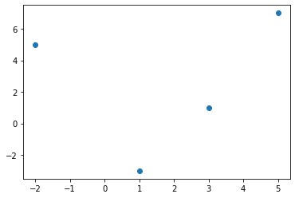
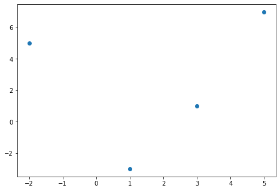
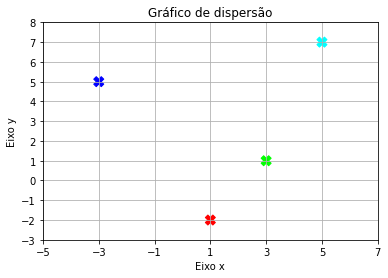
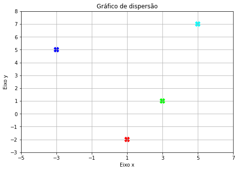
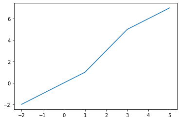
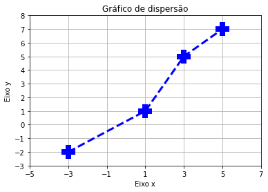
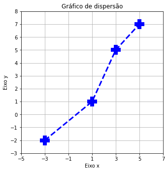
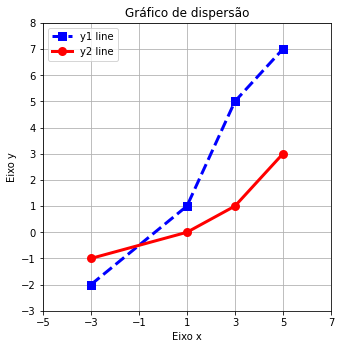
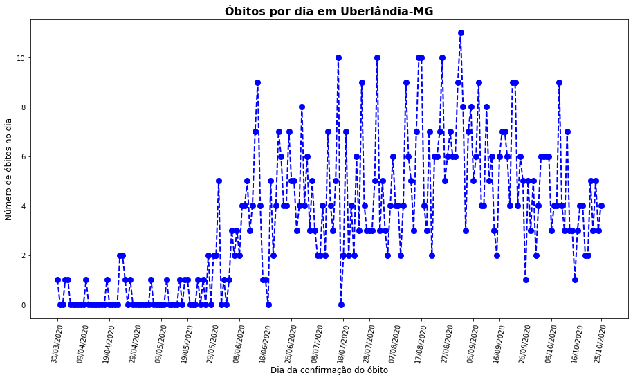

# Pontos no plano cartesiano


```python
import matplotlib.pyplot as plt
```

## Gráfico de dispersão


```python
x_coordinates = [1, 3, -2, 5]
y_coordinates = [-3, 1,  5, 7]

plt.scatter(x_coordinates, y_coordinates)
plt.show()
```


    

    


```python
x_coordinates = [1, 3, -2, 5]
y_coordinates = [-3, 1,  5, 7]

fig = plt.figure()
ax = fig.add_axes([0,0,1,1])

ax.scatter(x_coordinates, y_coordinates)
plt.show()
```


    

    


### Opções extras para o gráfico de dispersão


```python
x_coordinates = [1, 3, -3, 5]
y_coordinates = [-2, 1,  5, 7]

plt.scatter(
    x_coordinates, 
    y_coordinates,
    s = 100, # size of markers
    c = [(1,0,0), (0,1,0), (0,0,1), (0,1,1)], # colors of marker
    marker = 'X' # styles of markers
)

plt.xlabel("Eixo x")
plt.ylabel("Eixo y")
plt.title("Gráfico de dispersão")

plt.xticks([-5, -3, -1, 1, 3, 5, 7])
plt.yticks(list(range(-3, 9, 1)))

plt.grid("on")

plt.show()
```


    

    


```python
x_coordinates = [1, 3, -3, 5]
y_coordinates = [-2, 1,  5, 7]

fig = plt.figure()
ax = fig.add_axes([0,0,1,1])

ax.scatter(
    x_coordinates, 
    y_coordinates,
    s = 100, # size of markers
    c = [(1,0,0), (0,1,0), (0,0,1), (0,1,1)], # colors of marker
    marker = 'X' # style of markers
)

ax.set_xlabel("Eixo x")
ax.set_ylabel("Eixo y")
ax.set_title("Gráfico de dispersão")

ax.set_xticks([-5, -3, -1, 1, 3, 5, 7])
ax.set_yticks(list(range(-3, 9, 1)))

ax.grid("on")

plt.show()
```


    

    


## Gráfico de linha


```python
x_coordinates = [-2,  1, 3, 5]
y_coordinates = [-2, 1,  5, 7]

plt.plot(x_coordinates, y_coordinates)
plt.show()
```


    

    


### Opções extras para o gráfico de linha


```python
x_coordinates = [-3,  1, 3, 5]
y_coordinates = [-2, 1,  5, 7]

styles = {
    "linewidth": 3,
    "linestyle": '--',
    "color": 'b',
    "marker": '+',
    "markeredgewidth": 8, 
    "markersize": 20
}

plt.plot(
    x_coordinates, 
    y_coordinates,
    **styles
)

plt.xlabel("Eixo x")
plt.ylabel("Eixo y")
plt.title("Gráfico de dispersão")

plt.xticks([-5, -3, -1, 1, 3, 5, 7])
plt.yticks(list(range(-3, 9, 1)))

plt.grid('on')

plt.show()
```


    

    


```python
x_coordinates = [-3,  1, 3, 5]
y_coordinates = [-2, 1,  5, 7]

fig = plt.figure(figsize=(4,4))
ax = fig.add_axes([0,0,1,1])

line_styles = {
    "linewidth": 3,
    "linestyle": '--',
    "color": 'b',
}

marker_styles = {
    "marker": '+',
    "markeredgewidth": 8, 
    "markersize": 20
}

ax.plot(
    x_coordinates, 
    y_coordinates,
    **line_styles,
    **marker_styles,
)

ax.set_xlabel("Eixo x")
ax.set_ylabel("Eixo y")
ax.set_title("Gráfico de dispersão")

ax.set_xticks([-5, -3, -1, 1, 3, 5, 7])
ax.set_yticks(list(range(-3, 9, 1)))

plt.grid('on')

plt.show()
```


    

    


```python
x_coordinates = [-3,  1, 3, 5]
y1_coordinates = [-2, 1,  5, 7]
y2_coordinates = [-1, 0, 1, 3]

fig = plt.figure(figsize=(4,4))
ax = fig.add_axes([0,0,1,1])

line_styles_y1 = {
    "linewidth": 3,
    "linestyle": '--',
    "color": 'b',
}

marker_styles_y1 = {
    "marker": 's',
    "markeredgewidth": 4, 
    "markersize": 5
}

line_styles_y2 = {
    "linewidth": 3,
    "linestyle": '-',
    "color": 'r',
}

marker_styles_y2 = {
    "marker": 'o',
    "markeredgewidth": 4, 
    "markersize": 5
}

ax.plot(
    x_coordinates, 
    y1_coordinates,
    **line_styles_y1,
    **marker_styles_y1,
)

ax.plot(
    x_coordinates, 
    y2_coordinates,
    **line_styles_y2,
    **marker_styles_y2,
)

ax.set_xlabel("Eixo x")
ax.set_ylabel("Eixo y")
ax.set_title("Gráfico de dispersão")

ax.set_xticks([-5, -3, -1, 1, 3, 5, 7])
ax.set_yticks(list(range(-3, 9, 1)))

ax.legend(labels = ('y1 line', 'y2 line'), loc = 'upper left')

plt.grid('on')

plt.show()
```


    

    


## Aplicação

Gestores precisam saber tendências de queda ou ascenção de indicadores que norteiam as tomadas de ações no ambiente que atuam. Gráficos podem dar uma primeira visão sobre tais indicadores.

https://opendatasus.saude.gov.br/


```python
import pandas as pd
```


```python
# EXECUTAR ESTE CÓDIGO APENAS NA PRIMEIRA VEZ

# ler o arquivo
df = pd.read_csv("INFLUD26102020.csv", encoding ='latin1', sep=";", low_memory=False)

# filtrar por cidade e salvar em um novo arquivo
df[df["ID_MUNICIP"] == "UBERLANDIA"].to_csv("INFLUDUBERLANDIA.csv", index=None, encoding="utf-8")

# limpar a memória
del df
```


```python
# ler o arquivo da cidade considerada
df =  pd.read_csv("INFLUDUBERLANDIA.csv")

# remover colunas que não interessam
df = df[[
    "CLASSI_FIN", # 5 - SRAG por COVID
    "EVOLUCAO", # 1-cura, 2-obito, 3-obito por outras causas, 9-ignorado
    "DT_EVOLUCA", # data se EVOLUCAO = 1 ou 2
]]

# filtros de interesse
df = df[df["CLASSI_FIN"] == 5]
df = df[df["EVOLUCAO"] == 2]

# remover colunas que foram aplicadas filtros
df = df[["DT_EVOLUCA"]]

# transformar text em data
df["DT_EVOLUCA"] = pd.to_datetime(df["DT_EVOLUCA"], format='%d/%m/%Y')

# ordenar data
df = df.sort_values(by="DT_EVOLUCA")

# contar por dia
df['CONT'] = 1
df = df.groupby(["DT_EVOLUCA"]).sum()

idx = pd.date_range(df.index.min(), df.index.max())
df = df.reindex(idx)
df["CONT"] = df["CONT"].map(lambda x: x if str(x) != "nan" else 0)
```

    c:\users\lele\anaconda3\envs\py38geometria\lib\site-packages\IPython\core\interactiveshell.py:3145: DtypeWarning: Columns (63,108,123) have mixed types.Specify dtype option on import or set low_memory=False.
      has_raised = await self.run_ast_nodes(code_ast.body, cell_name,
    


```python
def indexToBrDate(indexDate):
    return pd.to_datetime(str(df.index.values[indexDate])).strftime('%d/%m/%Y')
```


```python
import numpy as np

x_coordinates = list(range(df.shape[0]))
y_coordinates = df['CONT'].values

media_acumulada_2_semanas = []
for i in range(len(y_coordinates)):
    if i >= 14:
        media_acumulada_2_semanas.append(np.mean(y_coordinates[i-14:i]))
        
media_acumulada_2_semanas = 14 * [0] + media_acumulada_2_semanas

fig = plt.figure(figsize=(12,6))
ax = fig.add_axes([0,0,1,1])

line_styles_y = {
    "linewidth": 2,
    "linestyle": '--',
    "color": 'b',
}

marker_styles_y = {
    "marker": 'o',
    "markeredgewidth": 4, 
    "markersize": 5
}

ax.plot(
    x_coordinates, 
    y_coordinates,
    **line_styles_y,
    **marker_styles_y,
)

ax.plot(
    x_coordinates, 
    media_acumulada_2_semanas,
    linestyle="-",
    linewidth = 3,
    color = 'r',
)

xticks = list(range(0, df.shape[0], 10)) + [209]
ax.set_xticks(xticks)
ax.set_xticklabels(list(map(indexToBrDate, xticks)),  rotation=80)

ax.set_xlabel("Dia da confirmação do óbito", fontsize=12)
ax.set_ylabel("Número de óbitos no dia", fontsize=12)
ax.set_title("Óbitos por dia em Uberlândia-MG", fontsize=16, fontweight="bold")

ax.legend(labels = ('Nº de óbitos', 'Média acumulada (2 semanas)'), loc = 'upper left')

plt.show()
```


    

    


```python

```


```python

```


```python

```
