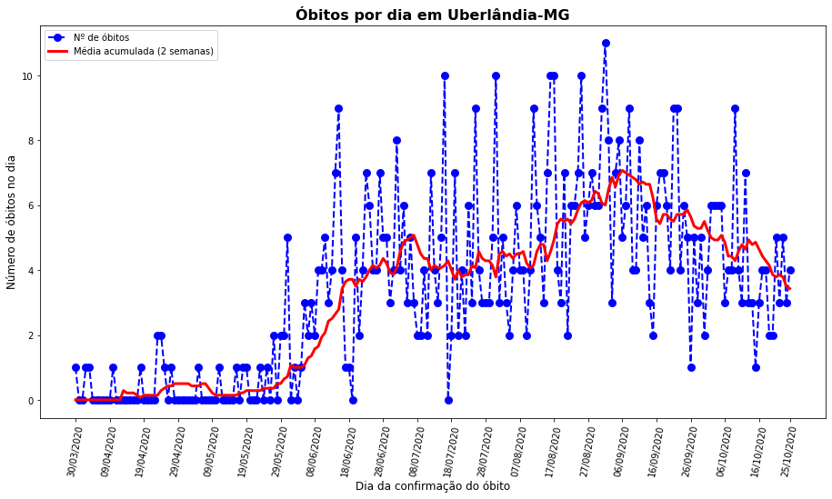
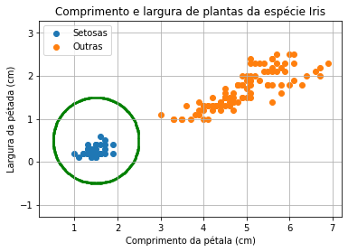
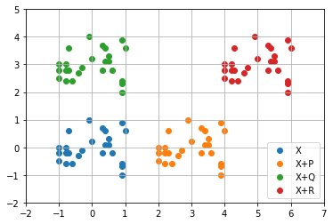
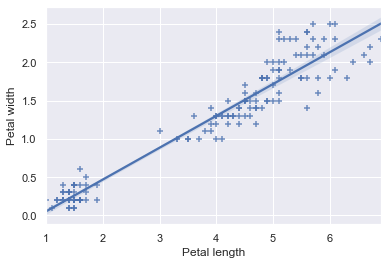
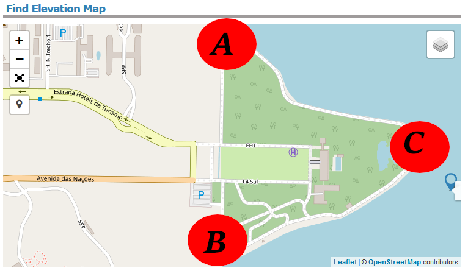
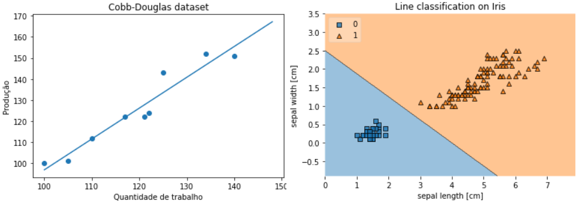
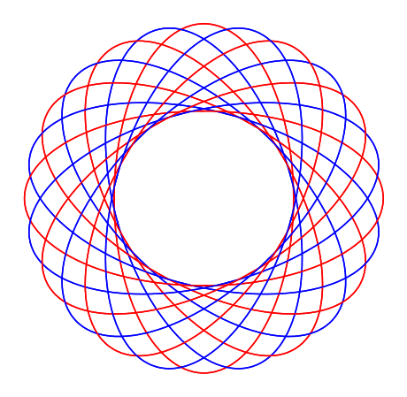

# Curso de geometria analítica aplicada com Python

Nesse curso utilizaremos conceitos de geometria analítica para resolver problemas do dia a dia.

Para tal, utilizaremos a linguagem de programação Python.

## SETUP

O setup aqui apresentado considera o uso do Anaconda Python 3.8, Visual Code Studio e sistema operacional Windows 10.

- No prompt de comando:
  - > conda create --name py38geometria python=3.8
  - > conda activate py38geometria
  - > pip install jupyterlab
  - > pip install pandas
  - > pip install matplotlib
  - > pip install seaborn
  - > pip install sklearn
  - > pip install scikit-learn
  - > jupyter-notebook
- Se encontrar o seguinte erro: `failed while importing win32api`
  - > pip install --upgrade pywin32==225
  - > jupyter-notebook
- Na próxima vez, basta iniciar diretamente o jupyter notebook:
  - > jupyter-notebook
- Para parar o jupyter notebook: `Ctrl+C` no prompt
- Para desativar o ambiente virtual:
  - > conda deactivate

## Capítulo 1: pontos no plano cartesiano

Neste capítulo representaremos pontos no plano cartesiano utilizando a biblioteca `matplotlib`.

Veremos como fazer gráficos de linhas e dispersão, bem como estilização dos mesmos.

Como atividade prática, faremos um gráfico de linha que apresenta o número de óbitos por COVID-19 de determinado município. Faremos conclusões sobre o comportamento do gráfico.

<h1 align="center">
  
</h1>

Acesse: https://github.com/leandrocl2005/geometria-analitica-aplicada/blob/main/001-pontos-no-plano-cartesiano.ipynb

## Capítulo 2: Distâncias e círculos

Neste capítulo trabalharemos funções que calculam distâncias euclideanas entre pontos do plano cartesiano. Também representaremos pontos de um círculo no plano cartesiano utilizando a biblioteca `matplotlib`.

Veremos como representar círculos com centro e raio qualquer num gráfico.

Como atividade prática, faremos um gráfico com comprimentos e larguras de pétalas da espécie Iris. Separaremos por cor tais espécies e a partir da equação de distância criaremos um círculo em volta dos pontos que representam a Iris Setosa. Concluiremos que é possível criar modelos simples com uso da equação do círculo.

<h1 align="center">
  
</h1>

Acesse: https://github.com/leandrocl2005/geometria-analitica-aplicada/blob/main/002-distancias-e-circulos.ipynb

## Capítulo 3: Vetores, soma e multiplicação por escalar

Neste capítulo trabalharemos as interpretações geométricas das operações de soma e multiplicação por escalar.

Como atividade prática, utilizaremos estas operações em dois tipos de normalização de dados. Faremos alguns experimentos vericando as propriedades desses processos.

<h1 align="center">
  
</h1>

Acesse: https://github.com/leandrocl2005/geometria-analitica-aplicada/blob/main/003-vetores-soma-multiplicacao-por-escalar.ipynb

## Capítulo 4: Vetores e produto interno

Neste capítulo estudaremos produto escalar e norma.

Como atividade prática, utilizaremos produto escalar para computar o coeficiente de correlação amostral entre duas variáveis. 

<h1 align="center">
  
</h1>

Acesse: https://github.com/leandrocl2005/geometria-analitica-aplicada/blob/main/004-vetores-produto-interno.ipynb

## Capítulo 5: Vetores e produto vetorial

Neste capítulo estudaremos produto vetorial.

Como atividade prática, utilizaremos produto vetorial para estimar a área do palácio da Alvorada, residência do presidente do Brasil. 

<h1 align="center">
  
</h1>

Acesse: https://github.com/leandrocl2005/geometria-analitica-aplicada/blob/main/005-vetores-produto-vetorial.ipynb

## Capítulo 6: Retas no plano cartesiano

Neste capítulo estudaremos retas no plano cartesiano.

Como atividade prática, utilizaremos retas para regressão linear e também para classificação de regiões.

<h1 align="center">
  
</h1>

Acesse: https://github.com/leandrocl2005/geometria-analitica-aplicada/blob/main/006-retas.ipynb

## Capítulo 7: Elipses

Neste capítulo estudaremos elipses no plano cartesiano.

Como atividade prática, utilizaremos elipses para criar artes abstratas.

<h1 align="center">
  
</h1>

Acesse: https://github.com/leandrocl2005/geometria-analitica-aplicada/blob/main/007-elipses.ipynb

## Referências

- https://opendatasus.saude.gov.br/
- https://archive.ics.uci.edu/ml/datasets/iris
- https://archive.ics.uci.edu/ml/machine-learning-databases/housing/