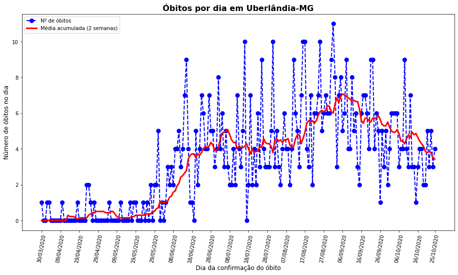

# Curso de geometria analítica aplicada com Python

Nesse curso utilizaremos conceitos de geometria analítica para resolver problemas do dia a dia.

Para tal, utilizaremos a linguagem de programação Python.

## SETUP

O setup aqui apresentado considera o uso do Anaconda Python 3.8, Visual Code Studio e sistema operacional Windows 10.

- No prompt de comando:
  > conda create --name py38geometria python=3.8
  > conda activate py38geometria
  > pip install jupyterlab
  > pip install pandas
  > pip install matplotlib
  > pip install seaborn
  > pip install sklearn
  > pip install scikit-learn
  > jupyter-notebook
- Se encontrar o seguinte erro: `failed while importing win32api`
  > pip install --upgrade pywin32==225
  > jupyter-notebook
- Na próxima vez, basta iniciar diretamente o jupyter notebook:
  > jupyter-notebook
- Para parar o jupyter notebook: `Ctrl+C` no prompt
- Para desativar o ambiente virtual:
  > conda deactivate

## Capítulo 1: pontos no plano cartesiano

Neste capítulos representaremos pontos no plano cartesiano utilizando a biblioteca `matplotlib`.

Veremos como fazer gráficos de linhas e dispersão, bem como estilização dos mesmos.

Como atividade prática, faremos um gráfico de linha que apresenta o número de óbitos por COVID-19 de determinado município. Faremos conclusões sobre o comportamento do gráfico.

<h1 align="center">
  
</h1>

Acesse: https://github.com/leandrocl2005/geometria-analitica-aplicada/blob/main/001-pontos-no-plano-cartesiano-markdown/001-pontos-no-plano-cartesiano.md

## Referências

- https://opendatasus.saude.gov.br/
